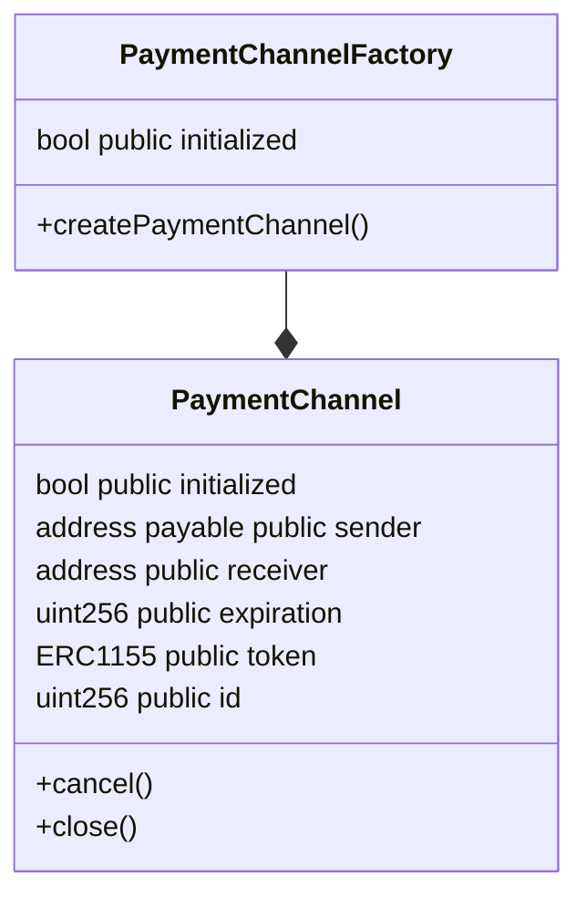

# Solidity Channel Exercise

This is my implementation of the follow exercise:

> This time, you will need to code a factory of payment channels that use the EIP 712.
> The specification of EIP 712 is up to you, but keep in mind that any user should be
> able to create signatures for any given channel without worrying about it being replayable
> in the same contract or in another.Note that as we will be creating a lot of payment channels,
> and they are going to be used with a few transactions to be later discarded, you should use
> minimal proxies to create them. Bonus points for using ERC 1155 tokens in the payment channels.
> Note: This contracts do NOT have to be upgradeable, change the library that you think it has
> to be changed.

## How I solved?

Here is the Diagram of the solution:



The `PaymentChannelFactory` is a minimal proxy that creates `PaymentChannel` instances.
The `PaymentChannel` is a payment channel that uses ERC1155 tokens.

## Prerequisites

Make sure you have installed the following:

- [nvm](https://github.com/nvm-sh/nvm) or [Node.js](https://nodejs.org/en) version `v16.10.0`

## Install

For install the project dependencies, run the following steps:

### With nvm

```shell
nvm install
nvm use

npm install
```

## Without nvm

```shell
npm install
```

## Run tests

```shell
npm run test
```

## License

[MIT License](LICENSE) &copy; [Rafael Castro](https://github.com/RafaelC457ro)
